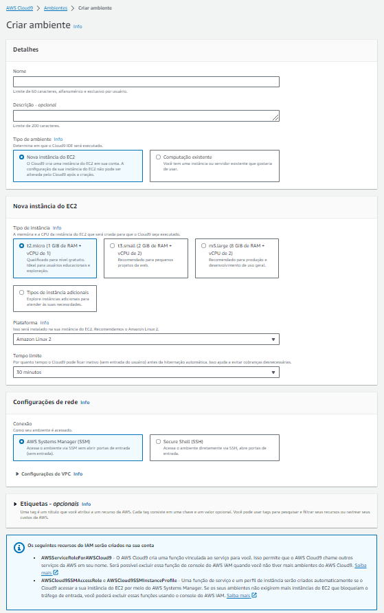
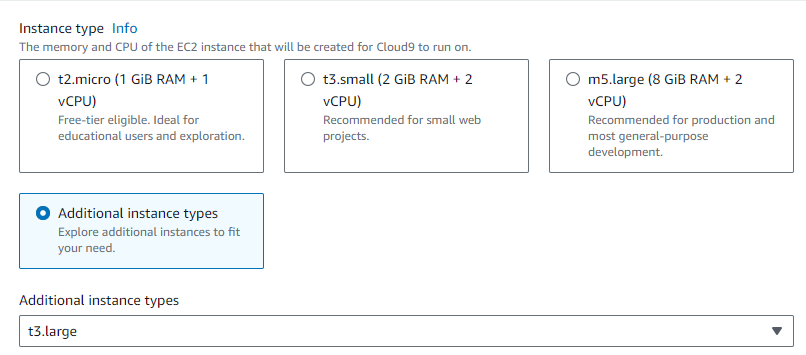
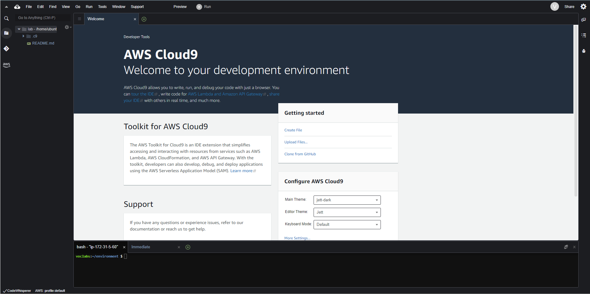

Author: Prof. Barbosa 
Contact: infobarbosa@gmail.com 
Github: [infobarbosa](https://github.com/infobarbosa)

# Ambiente Cloud9

Neste laboratório faremos uso recorrente do serviço Cloud9.

### 1. Região AWS

Verifique a região no topo à direita do console AWS, normalmente é **Norte da Virgínia**. 
**Não** altere essa configuração!

 

### 2. Abra o console da AWS e na caixa de busca superior digite **Cloud9**.

### 3. Clique no link Cloud9

### 4. Clique em **Criar ambiente**

---
>Outra forma de acesso ao console Cloud9 é via menu "sanduíche" (três barras horizontais) logo abaixo do logo da AWS.
>
>
>
>Ao abrir o menu, clique então em **Meus ambientes**
>
> 
>
>Você será direcionado ao console do Cloud9 onde também está disponível o botão **Criar ambiente**
>
>
---

### 5. Será exibida a tela **Criar ambiente** confirme seguir.

### 6. Campo **Nome**: informe `lab`.

### 7. Campo **Descrição**: deixe em branco.

### 8. **Tipo de ambiente**: selecione `Nova instância do EC2`.

### 9. **Tipo instância**: selecione `t3.large`

### 10. **Plataforma**: selecione `Ubuntu Server 22.04 LTS` 

### 11. **Tempo limite**: selecione `1 hora`

### 12. **Conexão**: deixe selecionado `Secure Shell (SSH)`

### 13. Clique em **Criar** ao final da página

>Leva de 2 a 3 minutos para o ambiente ser criado. 

Ao ser criado, seu ambiente aparece no console do Cloud9

### 14. Para abrir o IDE do ambiente criado, clique em "Em aberto" conforme a seguir:

### 15. Uma nova aba será aberta com o IDE do Cloud9 criado:

## Pronto! ;)
Seu ambiente Cloud9 está pronto pra uso! 
Agora você pode prosseguir com o laboratório [aqui](../README.md)
